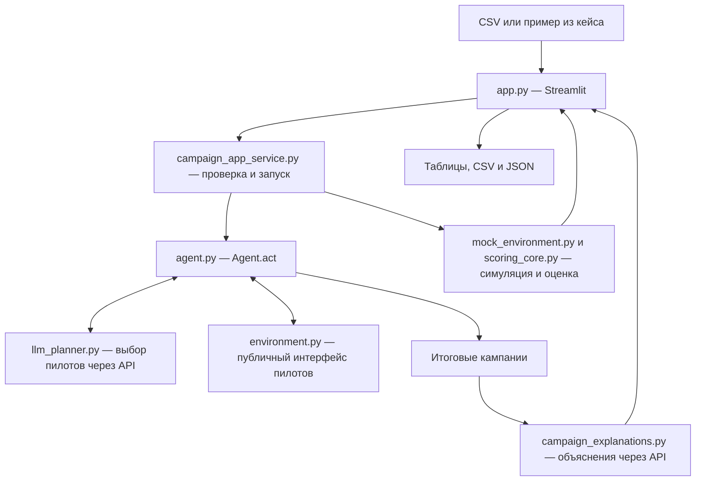

# Beeline Campaign Planner — агент тарифных маркетинговых кампаний

Рабочее место маркетингового аналитика: загрузить данные об абонентах, проверить
гипотезы небольшими пилотами и получить план предложений по смене тарифа —
сегменты, целевые тарифы, каналы связи и расходы.

Проект решает задачу распределения ограниченного бюджета: переход на другой тариф
может как увеличить ARPU — среднюю выручку на абонента, — так и снизить его.
Агент учитывает стоимость контактов и неопределённость результатов пилотов,
а LLM помогает выбирать эксперименты и объясняет готовый план.

**Все данные кейса синтетические.** В текущей версии пилоты проходят в симуляторе.
Приложение не отправляет реальные SMS, push-уведомления, рекламу или звонки.
Результат симуляции не является прогнозом реальной прибыли или балла судейства.

## Что реализовано

- Агент `Agent.act(env)`, совместимый с локальной средой хакатона.
- Веб-интерфейс на Streamlit: пример из кейса или загрузка трёх CSV в одну область.
- Определение назначения таблиц по колонкам, проверка формата, тарифов, сегментов,
  числовых значений и уникальности идентификаторов.
- Выбор гипотез LLM, запуск пилотов через `env.run_pilot`, повторные проверки
  перспективных вариантов и обновление статистических оценок.
- Выбор итоговых кампаний и каналов с учётом бюджета, числа контактов и риска.
- Показ прогресса, истории пилотов, оценок эффекта, расходов и результата симуляции.
- Объяснения LLM для каждого итогового перехода: интерес клиента, возможный эффект
  для компании, подтверждающие факты, риски и следующая проверка.
- Экспорт плана в CSV и отчёта в JSON; отдельная генерация `submission.csv` для сдачи.
- Ввод API-ключа в скрытое поле сайта и резервная статистическая логика при сбое API.

Лимиты локального кейса:

| Ресурс | Лимит |
| --- | ---: |
| Общий бюджет, включая пилоты | 100 000 у.е. |
| Все контакты, включая пилоты и повторные контакты | 15 000 |
| Пилоты | До 20 |
| Участники одного пилота | От 10 до 200 |
| Финальные кампании | До 10 |
| Абоненты одной финальной кампании | До 5 000 |

## Как работает решение

### Пользовательский сценарий

1. Аналитик открывает сайт и выбирает пример из кейса либо загружает три таблицы.
2. Приложение проверяет данные и показывает количество абонентов, переходов и тарифов.
3. Аналитик вводит ключ OpenAI API и разрешает передачу агрегатов для запуска.
4. После нажатия **«Исследовать и собрать план»** агент формирует кандидатов на пилоты.
5. LLM выбирает проверки из предложенного списка; агент запускает их в симуляторе
   и обновляет оценки эффекта и неопределённости.
6. Код формирует итоговый план кампаний. Отдельный запрос к LLM создаёт объяснения
   переходов на основании параметров тарифов, агрегатов сегментов, истории и пилотов.
7. Аналитик изучает результат и скачивает `campaign_plan.csv` и `campaign_report.json`.

Скачанный из приложения план не заменяет файл сдачи: `submission.csv` создаётся
командой `python make_submission.py` на стандартных данных и seed 42.

### Роли LLM и статистики

**LLM не обучается на загруженных CSV.** Используется готовая модель OpenAI.
Она выбирает пилоты и пишет объяснения; расчёт оценок, проверку лимитов и
распределение кампаний выполняет Python-код.

Кандидат на проверку — сочетание текущего тарифа, ARPU-сегмента и целевого тарифа.
История переходов задаёт слабую предварительную оценку. Агент планирует до четырёх
партий по пять пилотов: первые две исследуют варианты, следующие две уточняют
уже измеренные перспективные варианты. Все пилоты выполняются через канал `sms`.
LLM предлагает выборки по 100–200 человек; код уменьшает их при недостатке
аудитории или ресурсов.

После пилотов агент обновляет среднее и стандартную ошибку оценки. Для финального
выбора используется консервативная оценка `mean − 1.64 × standard_error`.
Жадный алгоритм сравнивает ожидаемый эффект с расходами на канал и оставшимися
лимитами. Между итоговыми кампаниями аудитории не пересекаются; с пилотами
пересечения возможны. Если прибыльных по оценке вариантов нет, код может выбрать
доступный протестированный сегмент для бесплатного `push`; положительного эффекта
это не гарантирует.

Объяснение LLM не меняет рассчитанный план. Если запрос объяснения завершается
ошибкой, план остаётся доступным, а сайт показывает предупреждение.

## Технологии

| Компонент | Использование |
| --- | --- |
| Python | Агент, обработка данных, симуляция, API-клиент и проверки |
| pandas `>=2.2,<4` | CSV, группировки, сегментация и отчёты |
| NumPy `>=1.26,<3` | Численные операции и случайность симуляции |
| Streamlit `>=1.64,<2` | Веб-интерфейс, загрузка файлов, таблицы и скачивание отчётов |
| OpenAI Responses API | Выбор пилотов и объяснение итоговых кампаний |
| `gpt-4.1-mini` | Модель по умолчанию; имя настраивается через `OPENAI_MODEL` |
| JSON Schema | Структурированный формат ответов модели с проверкой в коде |
| `urllib.request`, `unittest`, Streamlit AppTest | HTTP-запросы и автоматические проверки |

Отдельного backend-сервиса, базы данных и локальной LLM в проекте нет.
OpenAI SDK не требуется: запросы отправляются средствами стандартной библиотеки.

## Архитектура



Агент получает публичный интерфейс среды и наблюдения пилотов. Мок-модель эффектов
создаётся адаптером приложения или скриптом проверки; агент не читает её напрямую.

| Файл или каталог | Назначение |
| --- | --- |
| `agent.py` | Кандидаты, пилоты, обновление оценок, финальные кампании |
| `llm_planner.py` | Ограниченные вызовы API, проверка ответа, кэш и обработка ошибок |
| `app.py` | Страница аналитика и настройки запуска |
| `campaign_app_service.py` | Распознавание CSV, валидация, запуск агента, сбор отчёта |
| `campaign_explanations.py` | Агрегаты и объяснения итоговых тарифных переходов |
| `environment.py` | Интерфейс среды и выполнение пилотов |
| `mock_environment.py` | Локальная модель эффектов на основе истории переходов |
| `scoring_core.py` | Проверка кампаний, ограничения, стоимость и оценка результата |
| `local_eval.py` | Проверка агента на одном или нескольких seed |
| `make_submission.py`, `submission.csv` | Генератор и файл кампаний для сдачи |
| `customer_profile.csv`, `data/` | Основные данные кейса |
| `llm_responses/` | 10 сохранённых ответов для воспроизводимости командных запусков |
| `test_app.py` | Проверки сервиса, интерфейса, API-ошибок и объяснений |
| `requirements.txt` | Общие зависимости агента и веб-приложения |
| `.streamlit/config.toml` | Цветовая тема интерфейса |

## Установка и запуск

Команды выполняются из корня репозитория. Локальная проверка проекта выполнена
на Python 3.14.7. Зависимости устанавливаются из файлов `requirements`;
полной фиксации транзитивных версий в проекте нет.

### 1. Создать окружение и установить зависимости

```bash
python3 -m venv .venv
source .venv/bin/activate
python -m pip install -r requirements.txt
```

В Windows PowerShell окружение активируется командой `.venv\Scripts\Activate.ps1`.
Один файл `requirements.txt` устанавливает зависимости агента, сайта и тестов.

### 2. Запустить приложение

```bash
python -m streamlit run app.py --server.address 127.0.0.1 --server.port 8501 --browser.gatherUsageStats false
```

Открыть [http://127.0.0.1:8501](http://127.0.0.1:8501).
В боковой панели ввести ключ в поле **«Ключ OpenAI API»** и подтвердить передачу
агрегатов. Без ключа и разрешения кнопка запуска недоступна.

Сайт использует только режим новых запросов к API, без подстановки сохранённых
ответов. За одно исследование возможно до пяти платных запросов: четыре для
выбора пилотов и один для объяснения плана. Для работы API нужен доступ к интернету
и ключ с доступом к выбранной модели.

Ключ можно задать на сервере вместо ввода на сайте. В Bash, без записи значения
в команду истории:

```bash
read -rsp 'OpenAI API key: ' OPENAI_API_KEY
export OPENAI_API_KEY
```

После этого запустить приложение из того же терминала. Если ключ введён на сайте,
он имеет приоритет над серверным. Файл `.env` автоматически **не загружается**.

### 3. Запустить агента и создать файл сдачи

Для воспроизводимой проверки без запросов к API в Bash:

```bash
export AGENT_LLM_MODE=replay
python local_eval.py
python make_submission.py
```

Для проверки разброса результатов:

```bash
python local_eval.py --runs 10
```

Эти команды используют основные CSV репозитория. `make_submission.py`
перезаписывает `submission.csv` результатом запуска с seed 42.

### Настройки командного агента

Эти режимы относятся к `Agent()` в командной строке. Переключателя режимов на сайте нет.

| Переменная | Назначение |
| --- | --- |
| `OPENAI_API_KEY` | Ключ OpenAI; значение не должно попадать в Git |
| `OPENAI_MODEL` | Имя модели, по умолчанию `gpt-4.1-mini` |
| `AGENT_LLM_MODE=auto` | По умолчанию: точное совпадение с сохранённым ответом, затем API; при недоступности — статистика |
| `AGENT_LLM_MODE=api` | Новые вызовы API без чтения сохранённых ответов; при сбое — статистика |
| `AGENT_LLM_MODE=replay` | Сохранённые ответы; при отсутствии совпадения — статистика, без сети |
| `AGENT_LLM_MODE=off` | Только статистический выбор пилотов |
| `AGENT_LLM_CACHE` | Каталог кэша командного запуска, по умолчанию `.llm_cache` |

Сохранённый ответ применяется только при совпадении хеша полного запроса:
модели, инструкций, схемы, кандидатов, наблюдений и лимитов. Это кэширование,
а не обучение модели. Для воспроизводимости стандартного файла сдачи следует
сохранить `llm_responses/`, исходные данные и настройки модели.

### Проверка сайта

1. Запустить приложение и выбрать **«Пример из кейса»**.
2. Ввести действующий API-ключ, разрешить передачу агрегатов и запустить исследование.
3. Дождаться плана. Проверить тарифы, каналы, расходы, историю пилотов и блок
   **«Почему переход может быть выгоден клиенту и компании»**.
4. Скачать CSV и JSON. При успешном ответе API объяснения присутствуют и в JSON.
5. Выбрать **«Загрузить CSV»** и добавить вместе три основных файла репозитория:
   `customer_profile.csv`, `data/change_tariff.csv`, `data/dict_tariff.csv`.
6. Убедиться, что приложение распознало таблицы. Удаление одного обязательного
   файла должно блокировать запуск; при изменении набора данных прежний результат очищается.

Seed в параметрах задаёт случайность пилотов. Одинаковый seed воспроизводит
случайность симулятора при одинаковой последовательности действий, но новые
ответы OpenAI могут изменить эту последовательность и итоговый план.

### Автоматические проверки

```bash
python -m unittest test_app -v
```

В репозитории 14 тестов: проверка входных данных, общей области загрузки,
полного сценария интерфейса, изоляции ключей, блокировки запуска, обхода кэша
в API-режиме, объяснений и сохранения плана при ошибке API. Сетевые ответы
подменяются тестовыми; реальные платные обращения не выполняются.
Один из тестов сравнивает воспроизведённый CSV со стандартным `submission.csv`.

## Данные и интеграции

Основной комплект в репозитории:

| Файл | Строк | Содержимое |
| --- | ---: | --- |
| `customer_profile.csv` | 23 441 | Профили, текущие тарифы, признаки потребления, сегменты и `predicted_arpu` |
| `data/change_tariff.csv` | 14 823 | Исторические переходы и ARPU до/после |
| `data/dict_tariff.csv` | 21 | Коды, цены и параметры тарифных пакетов |

### Формат загрузок

CSV в UTF-8, с запятой или точкой с запятой в качестве разделителя; до 20 МБ
на файл и до 100 000 строк в каждой таблице. Порядок и имена файлов произвольны:
приложение определяет таблицы по обязательным колонкам.

| Таблица | Обязательные колонки |
| --- | --- |
| Профили | `ID_NUMBER`, `current_tariff`, `arpu_segment`, `data_segment`, `call_segment`, `predicted_arpu` |
| Переходы | `ID_NUMBER`, `tariff_plan_code_from`, `tariff_plan_code_to`, `AVG_ARPU_PREV_3M`, `AVG_ARPU_NEXT_3M` |
| Тарифы | `tariff_plan_code`, `price_tariff` |

Для содержательного сравнения пакетов используются также `Data_in_PKG`,
`Min_another_operator_in_PKG`, `Min_another_operator_and_city_in_PKG`.
Если этих колонок нет, соответствующие параметры для объяснения считаются неизвестными.

Сегменты: ARPU — `LOW/MID/HIGH`, интернет — `NON_USER/LITE/HEAVY`,
звонки — `LOW/MEDIUM/HIGH`. Коды тарифов должны состоять из латинских букв,
цифр, дефиса или подчёркивания и существовать в справочнике. Нужны минимум
два тарифа и хотя бы один сегмент «текущий тариф × ARPU» от 10 абонентов.
История с ARPU до перехода менее 100 исключается из оценки эффекта.
Дубли таблиц и неоднозначные схемы блокируют загрузку; неподходящие дополнительные
файлы отмечаются как неиспользуемые.

### API и хранение

Единственная реализованная внешняя AI-интеграция — OpenAI Responses API
(`https://api.openai.com/v1/responses`). Передаются агрегаты кандидатов и пилотов;
для объяснения — также параметры тарифов и агрегированная история переходов.
Идентификаторы абонентов и произвольные дополнительные колонки CSV в запросы не входят.
Запросы используют `store: false`; это параметр API, а не обещание отсутствия
любой обработки или хранения на стороне внешнего провайдера.

Загрузки и введённый на сайте ключ хранятся в текущей сессии. Ключ не записывается
в файлы, кэш или отчёты и не меняет окружение сервера. Кнопка очистки удаляет его
из поля и сбрасывает разрешение. Серверный ключ в браузер не подставляется.
Временный кэш планировщика приложения удаляется после работы агента;
исходные CSV не перезаписываются. `.env` и `.llm_cache/` исключены через `.gitignore`.

## Ограничения текущей версии

- **Симуляция, а не запуск кампаний.** Интеграций с биллингом, CRM и системами
  рассылок нет. Эффекты на судействе отличаются от локальной мок-модели.
- **Нет гарантии прибыли.** Скоринг оценивает прирост выручки за вычетом контактов,
  без полной себестоимости услуг. Пилоты тоже расходуют бюджет; при слабом или
  отрицательном сигнале результат может оказаться убыточным.
- **Ограниченный поиск.** До четырёх партий пилотов, ограниченный список кандидатов
  и жадное распределение ресурсов не гарантируют глобально оптимальный план.
  При недостатке подходящих данных итоговый список может быть пустым.
- **Перенос эффекта между каналами приближённый.** Пилоты проводятся через SMS;
  финальные каналы сравниваются по множителям среды, без отдельных пилотов каждого канала.
- **Признаки должны быть готовы.** Проект не обучает модель `predicted_arpu`,
  не подготавливает произвольные сырые выгрузки и не дообучает LLM.
- **Ответы LLM требуют проверки.** Структура ответа проверяется кодом, но
  достоверность всех текстовых выводов автоматически не доказывается.
  При сбое выбора пилотов используется статистика; при сбое объяснения оно не показывается.
- **Ограничения времени программные.** Новая партия не начинается после 210 секунд
  работы агента, новый пилот — после 240. Таймаут каждого API-вызова — 25 секунд,
  без повторов. Запрос итогового объяснения не начинается после 540 секунд работы
  приложения. Общего принудительного прерывания на 10-й минуте нет:
  зависший вызов среды или долгая локальная обработка этими проверками не прерываются.
- **Локальное приложение.** Нет авторизации сотрудников, фоновой очереди задач,
  постоянного хранилища исследований и конфигурации промышленного развёртывания.
- **Воспроизводимость зависит от режима.** Новые ответы API, изменение модели,
  данных или версий зависимостей могут изменить план и `submission.csv`.
